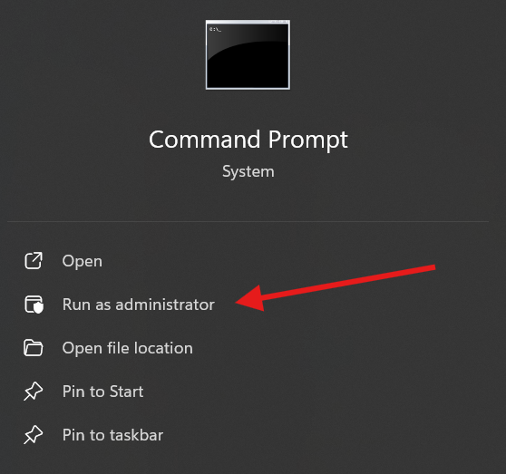
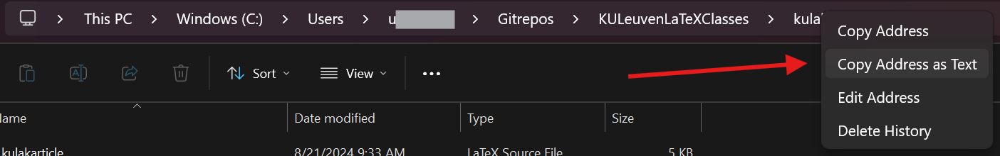
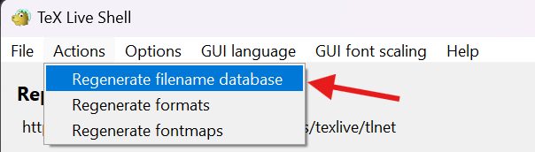

# KULeuvenLaTeXClasses
## readme.pdf
Dit, maar uitgebreider.

## Kulak
LaTeX class-files volgens KU Leuven huisstijl (inclusief Kulak en Brugge)

### Windows + TeXLive:

#### De bronbestanden op de juiste locatie op je computer plaatsen

*eenvoudige maar minder elegante manier:* Map `Kulak` verplaatsen naar `C:\texlive\texmf-local\tex\latex\local`

*technischer maar zorgt ervoor dat bestanden [up to date blijven](#waarom-kiezen-voor-symlinks):*
als alternatief kan je een symbolische link creëren naar de plaats waar je de git repository hebt gecloned vanop GitHub.

1. Open de Windows Command Prompt als administrator



2. Vind de locatie van deze repository op je computer.
Dit kan bijvoorbeeld door Windows Verkenner te openen en naar de map met deze repository te navigeren.
Specifiek heb je de map `kulak` nodig.
Als je met je rechtermuisknop op `kulak` klikt in de navigatiebalk binnen Windows Verkenner, kan je dan het adres kopiëren:



Dit geeft in het geval van de afbeelding `C:\Users\uXXXXXXX\Gitrepos\KULeuvenLaTeXClasses\kulak`

Navigeer in Command Prompt naar deze locatie met het commando 

```
> dir C:\Users\uXXXXXXX\Gitrepos\KULeuvenLaTeXClasses\kulak
```

3. Vind de map waar `texlive` geinstalleerd is. Het adres is bijvoorbeeld `C:\texlive\`

4. Geef nu het volgende commando in bij Command Prompt:

```
mklink /D C:\texlive\texmf-local\tex\latex\local\kulak kulak
```

Hierbij moet je `C:\texlive\` eventueel vervangen door de locatie waar `texlive` geïnstalleerd is op jouw computer.
Je hebt nu een symbolische link gecreëerd die verwijst naar de map `kulak` van deze repository.

#### De bronbestanden voor de Texlive distributie updaten

*texlive installatie van voor 2019:* `TeX Live Manager` openen en `Update Filename Database` uitvoeren

*texlive installatie van na 2019:* In `TeX Live Shell` klikken op `Actions` -> `Regenerate filename database`



> **Let op:** mogelijks moet je dit telkens wanneer je deze repository clonet en dus een geüpdate versie op je computer hebt, de database ook updaten via bovenstaande instructies.

### OS X + MacTeX:

Map `kulak` verplaatsen naar `~/Library/texmf/tex/latex/`

### Linux + TeXLive:

- Map `kulak` verplaatsen naar `~/texmf/tex/latex/` of een [symlink](#waarom-kiezen-voor-symlinks) creëren met `ln -s locatie-git-repo/kulak ~/texmf/tex/latex`
- Commando `texhash ~/texmf` in terminal uitvoeren

## Templates

Minimale `.tex`-bestanden horend bij de class-files

### Windows + TeXstudio

- Map `Templates` verplaatsen naar `C:\Users\<username>\AppData\Roaming\texstudio\templates\user`
- TeXstudio herstarten en `New From Template...`

### Linux/OS X + TeXstudio

- Map `Templates` verplaatsen naar `~/.config/texstudio/templates/user`
- TeXstudio herstarten en `New From Template...`

## Examples

Voorbeeldbestanden bij alle class-files

## Waarom kiezen voor symlinks

"Symlinks" staat voor symbolische links, je kan het vergelijken met een loophole of shortcut naar een map of bestand dat elders op je computer staat.
De reden waarom deze nuttig zijn in dit geval is om ervoor te zorgen dat jouw computer steeds de laatste versie van deze bestanden gebruikt.
Om de laatste versie te verkrijgen, pull je deze repository en volg je de instructies om de texlive database te updaten (zie hierboven).
